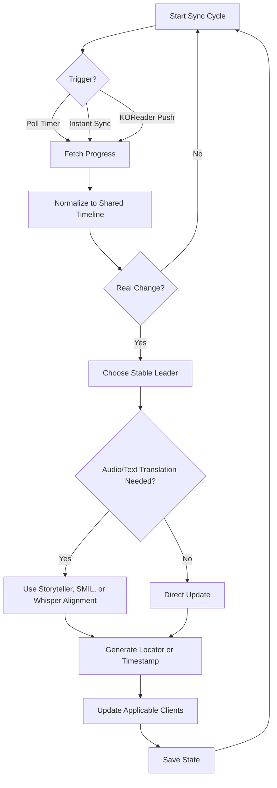

# BookBridge

<!-- markdownlint-disable MD033 -->

**The ultimate bridge for cross-platform reading and listening synchronization.**

[Getting Started](getting-started.md){ .md-button .md-button--primary }
[View on GitHub](https://github.com/cporcellijr/bookbridge){ .md-button }

<!-- markdownlint-enable MD033 -->

---

## What is it?

**BookBridge** is a self-hosted sync engine for audiobooks and ebooks. It keeps your reading and listening position aligned across multiple apps, whether the source is Audiobookshelf, Grimmory, KOReader, or Storyteller.

### Five-Way Synchronization

| Platform | Type | Capability |
| :--- | :--- | :--- |
| **Audiobookshelf** | Audiobooks + optional ebooks | Full read/write sync |
| **KOReader / KOSync** | Ebooks | Full read/write sync |
| **Storyteller** | Read-along reader | Full read/write sync |
| **Grimmory** | Ebooks + audiobooks | Full read/write sync |
| **Hardcover.app** | Reading tracker | Write-only tracking |

!!! note "BookOrbit"
    [BookOrbit](configuration.md#bookorbit) is also supported as a newer ebook library manager. You can use it in place of, or alongside, Grimmory.

---

## Features

### Core Sync Engine

- **Five-way sync** across Audiobookshelf, KOReader, Storyteller, Grimmory, and Hardcover.
- **Flexible source support**: use Audiobookshelf or Grimmory as the audio source, or create ebook-only links when no audiobook is needed.
- **Split-port security** so the KOSync endpoint can be exposed separately from the dashboard.
- **Smart conflict handling** with anti-regression guardrails and a deadband to avoid tiny cross-format bounce-backs.
- **Rich locators** using timestamps, href/fragment data, XPath, and EPUB CFI where available.
- **Storyteller-first alignment** when valid Storyteller transcript assets exist, followed by SMIL and Whisper fallback.
- **Resumable jobs** for background processing and transcript work.

### Management Web UI

- **Multiple readers** with their own sign-in, their own service logins, and their own progress — each person sees only the books they are reading.
- **Dashboard** for live sync status, reading session details, direct service links, and source badges.
- **Add Book** for ABS, Grimmory, Storyteller, or ebook-only matching flows.
- **Batch Match** for queue-based review and bulk linking.
- **Library Suggestions** for background scanning, review, and queue building.
- **Forge** for Storyteller read-along preparation.
- **Dynamic Settings** with live connection tests and automatic restart after saving.
- **Flexible setup** including an intentional Audiobookshelf-off mode for ebook-only or maintenance-focused use.
- **Optional Bridge Sync plugin support** for turning Grimmory shelves into KOReader collections.

### Automation and Reliability

- **Background daemon** with configurable polling.
- **Instant sync** from ABS playback events and KOReader pushes when enabled.
- **Per-client polling** for Storyteller, Grimmory, and BookOrbit.
- **Grimmory cache refresh** and Storyteller backfill maintenance tools.
- **Optional local-LLM assist (Ollama)** for smarter match suggestions and alignment rescue — off by default.

---

## How It Works

1. **Triggers**: the bridge reacts to ABS playback events, KOReader pushes, or scheduled polling.
2. **Normalization**: timestamps, percentages, CFI, and Storyteller locators are converted into a shared timeline.
3. **Change check**: tiny gaps are ignored so harmless drift does not cause sync churn.
4. **Leader election**: the bridge picks the most trustworthy current position.
5. **Translation**: if audio and text need to cross formats, the bridge resolves that position through Storyteller transcript data, SMIL, or Whisper alignment.
6. **Propagation**: the resolved position is written back to every applicable client for that mapping.

!!! note "Storyteller and Grimmory"
    Storyteller transcript assets improve locator quality, and Grimmory can now act as either an ebook target or the audiobook source for a mapping.
